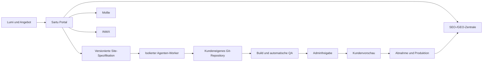

# Sartu - Designsystem, Portal- und KI-Architektur

Verbindliches Sollkonzept fuer Sartu-Marke, Kundenportal, Adminportal, Kundenseiten und KI-gestuetzte Produktion. Diese Datei konkretisiert `GESCHAEFTSMODELL.md`; Preise und Angebotsregeln werden nicht hier gepflegt.

Stand: Juli 2026.

---

## 1. Architekturentscheidung

Sartu besteht aus drei getrennten Produkten:

1. **Sartu-Vertriebswebsite:** erklaert das Angebot und fuehrt in Lumi.
2. **Sartu-Control-Plane:** Kundenportal und Adminportal fuer alle Geschaefts- und Betriebsablaeufe.
3. **Kundenseiten:** getrennte, individuell generierte und versionierte Codeprojekte.

Das Portal ist kein CMS fuer freie Seitengestaltung. Es verwaltet strukturierte Unternehmensdaten, Status, Freigaben und Produktionsauftraege. Kundenseiten werden aus versionierten Spezifikationen und dem Sartu-Designsystem gebaut.

---

## 2. Technische Grundrichtung

### Control-Plane

Die vorhandene individuelle PHP-/MySQL-Loesung ist als Prototyp brauchbar, aber fuer Zahlungen, Rollen, Audit-Logs, Queues, Domainverwaltung und Agentenjobs zu riskant als dauerhaft handgepflegte Eigenarchitektur.

**Umgesetzte Referenz und Produktionsrichtung:**

- Die ausfuehrbare Referenz-Control-Plane liegt als getrennte Node-24-Anwendung mit eingebautem HTTP-Server, SQLite, Adminportal und Kundenportal vor. Sie beweist Datenmodell, Rollen, Statusregeln und Integrationsvertraege ohne Abhaengigkeit von der alten Website.
- SQLite und Demo-Header sind ausschliesslich fuer lokale Entwicklung und Musterprozesse vorgesehen. Das Produktivsystem nutzt PostgreSQL als relationale Hauptdatenbank und eine echte Identitaetsloesung hinter dem Reverse Proxy.
- Ein Frameworkwechsel ist keine fachliche Voraussetzung. Entscheidend sind gepflegte Laufzeit, Migrationen, Tests, Sicherheitsupdates und die hier definierten Servicegrenzen; eine erneute parallele PHP-Logik wird nicht aufgebaut.
- Redis fuer Queue, Rate Limits, Locks und kurzlebige Zustaende.
- S3-kompatibler Objektspeicher in Deutschland/EU fuer Uploads, Exporte und QA-Artefakte.
- eine kompakte Portaloberflaeche ohne CMS- oder Page-Builder-Abhaengigkeit; Interaktivitaet folgt den fachlichen Aktionen und nicht einem allgemeinen Website-Editor.
- getrennte Worker fuer E-Mail, PDFs, Mollie, Domains, Crawls, Agentenjobs und Deployments.
- rollenbasierte Zugriffe, Audit-Log und Zwei-Faktor-Authentifizierung fuer Admins.

Die existierenden Daten werden migriert. Sicherheitskritische Portalbereiche werden nicht parallel in zwei unabhaengigen Logiken weiterentwickelt.

Der aktuelle Referenzstand deckt Lumi-Bedarfsscheck, Regelentscheidung, Lead-Erzeugung, Lead-zu-Angebot-Workflow, Paketkatalog, Angebot und Annahme, Rechnungsmeilensteine, Mollie-Checkoutvertrag, Domain-Inhaberkontakt, Domainvorschlag und Registrierung, Projekte, Aufgaben, Material- und Rechtefreigaben, Produktionshandoff, Seitenstruktur, Spezifikationsversion, initialen Agentenbuild, Seitenstatus, Oeffnungszeiten, Lead-Inbox, Support, Audit, Agentenmanifest, QA-Freigabe, versionierte Kundenvorschau, Vorschauabnahme, Schlussrate, Launch-Gate, produktive Deployment-Spur, kontrollierten Rollback, Exportartefakte und SEO-/GEO-Flottenscan ab. Live-Zahlung, OT&E-Domainlebenszyklus, Identitaet, echtes Mandat, echte Hosting-Deployments, Wiederherstellung und baubarer Kundenexport muessen mit echten Testkonten beziehungsweise produktionsnaher Infrastruktur vor Marktstart abgenommen werden.

### Kundenseiten

**Empfehlung:** static-first TypeScript-Projekte, vorzugsweise Astro oder ein gleichwertiger statischer Generator.

- ein Repository pro Kunde.
- ein gemeinsamer, versionierter Sartu-Starter.
- ein versioniertes Designsystem-Paket.
- strukturierte Inhalte statt freiem HTML aus dem Portal.
- statischer Build fuer Geschwindigkeit, Sicherheit und geringen Wartungsaufwand.
- Formulare und andere dynamische Funktionen laufen ueber eng begrenzte Portal-APIs.
- jede Produktion ist reproduzierbar, testbar, exportierbar und rueckrollbar.

Der kundenspezifische Quellstand muss auch nach Vertragsende baubar bleiben. Fuer den Export werden die fuer diesen Stand notwendigen Designsystem-Komponenten in einer eingefrorenen Projektversion mitgeliefert oder im Kundenrepository vendort. Das private, weiterentwickelte Sartu-Masterpaket, Generatoren und Prompts bleiben intern.

Kundenseiten duerfen nicht zur Laufzeit auf die komplette Portaldatenbank zugreifen. Das Portal erzeugt signierte, validierte Inhaltsartefakte; eine Aenderung startet einen neuen Build und ein kontrolliertes Deployment.

---

## 3. Strukturierte Projektspezifikation

Jeder Produktionsauftrag basiert auf unveraenderlichen, versionierten Dateien. Der Agent bekommt keine chaotische Mischung aus Freitext, E-Mails und Datenbanktabellen.

| Datei | Zweck |
|---|---|
| `site-spec.json` | Paket, Ziele, Sitemap, Conversion, Sprache, freigegebener Scope |
| `business.json` | bestaetigte Unternehmensfakten, Kontakte, Oeffnungszeiten, Regionen |
| `audiences.json` | Zielgruppen, Probleme, Einwaende, gewuenschte Handlungen |
| `services.json` | strukturierte Leistungen und belegbare Details |
| `proof.json` | Team, Qualifikationen, Projekte, Referenzen und freigegebene Belege |
| `project-records.json` | kompakte bestaetigte Projektfakten fuer Hauptangebot, Leistungen, Belege und Conversionweg |
| `content-plan.json` | Seitenthema, Suchintention, Kernbotschaft, CTA und interne Links |
| `brand.json` | Logo, Bildwelt, vorhandene Markenwerte und abgeleitete visuelle Rollen |
| `legal.json` | freigegebene Anbieter, Einbindungen, Rechtstext-Quellen und Consentbedarf |
| `seo.json` | URLs, Metadatenregeln, Canonicals, strukturierte Datentypen, Redirects |
| `design-manifest.json` | Designsystemversion, Tokens, Komponentenvarianten und Ausnahmen |
| `acceptance.json` | freigegebener Briefingstand, Verantwortliche, Zeitstempel und Hashes |

Jede Datei hat Schema-Version, Projekt-ID, Erstellungszeit, Quelle und Freigabestatus. Nur bestaetigte Fakten duerfen als Tatsachen in die Website gelangen.

---

## 4. Agenten-Produktionssystem

### Anbieteradapter

Das Portal kennt einen neutralen Auftrag `WebsiteBuildJob`. Ein Adapter uebersetzt ihn in:

- Codex `exec` fuer nicht interaktive, protokollierbare Produktionslaeufe.
- Claude Code SDK beziehungsweise Headless-Modus als alternative Engine.

Das Kundenangebot nennt keinen garantierten Modellanbieter. Dadurch koennen Kosten, Qualitaet und Verfuegbarkeit intern optimiert werden.

Die Referenzimplementierung erzeugt fuer jeden Job `manifest.json`, `prompt.txt` und eine Starter-Quelle mit `site-data.json`, eingefrorenem Designsystem, bestaetigten `projectRecords` und Build-Check. Fehlt das Kundenrepository im Worker-Arbeitsbereich oder ist es leer, wird es aus dieser Starter-Quelle angelegt. Ein separater Worker startet den konfigurierten Befehl ohne Shell, mit begrenzter Umgebungsvariablen-Allowlist und nur im Kundenrepository. Das Webportal selbst startet keinen Agentenprozess im oeffentlichen Request.

Das maschinenlesbare Basissystem `sartu-web-v1.json` enthaelt Designprinzipien, Tokens, Pflichtkomponenten, Seitentypen, Paketgrenzen, editierbare und Sartu-verwaltete Felder, SEO-/GEO-Basis, QA-Gates und Exportvertrag. Kundenspezifische Gestaltung entsteht durch Rollen und Komposition innerhalb dieser Grenzen, nicht durch das Kopieren einer immer gleichen Vorlage.

### Sicherheitsgrenzen

- kein Agentenlauf in einem oeffentlichen Webrequest.
- ein ephemerer Container oder eine isolierte virtuelle Umgebung pro Job.
- Schreibzugriff nur auf das eine Kundenrepository und einen temporaeren Artefaktordner.
- keine Portal-, Mollie-, Registrar- oder Produktionsdatenbank-Zugangsdaten im Agentencontainer.
- Netzwerkzugriff standardmaessig gesperrt; freigegebene Paketquellen und Dienste ueber Allowlist.
- kurzlebige, eng begrenzte Git-Zugangsdaten nur fuer den Job-Branch.
- maximale Laufzeit, Kostenbudget, Turn-Limit und Abbruchsignal.
- keine direkte Produktionserlaubnis fuer den Agenten.
- Kundenfreitext und externe Websites gelten als nicht vertrauenswuerdige Eingaben.

### Jobstatus

`queued -> preparing -> running -> validating -> admin_review -> customer_preview -> approved -> deploying -> live`

Fehlerzustaende: `needs_input`, `qa_failed`, `agent_failed`, `deployment_failed`, `rolled_back`, `cancelled`.

### Produktionshandoff

Wenn alle notwendigen Onboarding-Aufgaben erledigt sind, erzeugt der Adminbereich aus Projekt, Angebot, bestaetigten Aufgaben und Designsystemversion eine Spezifikationsfassung. Dabei entstehen Website-Datensatz, Repository-Ziel, initiale Seitenstruktur, `spec-v1` mit Hash, Starter-Source und ein `initial_build`-Agentenjob. Der Agent bekommt diese Spezifikation, die Starter-Source und die freigegebene Designsystemversion, aber keine Zahl-, Domain-, Portal- oder Produktionsschluessel. Die Adminfreigabe eines erfolgreichen Jobs erzeugt eine neue Vorschauversion, eine Deployment-Spur, eine Preview-URL und setzt Projekt sowie Website in `customer_preview`.

### Adminansicht je Job

- Kunde, Projekt, Auftrag und Designsystemversion.
- verwendeter Anbieter und Modellklasse.
- Laufzeit, Token-/API-Kosten und Anzahl der Versuche.
- maschinenlesbares Ereignisprotokoll.
- Git-Diff und geaenderte Dateien.
- QA-Ergebnisse und Screenshots.
- offene Risiken, fehlende Fakten und Agentenannahmen.
- Buttons fuer `erneut pruefen`, `Korrekturauftrag`, `Vorschau freigeben`, `verwerfen` und `rollback`.

---

## 5. Automatische Qualitaetsgates

Kein Agentenergebnis wird nur deshalb akzeptiert, weil der Build erfolgreich war.

### Pflichtgates

1. **Schema:** alle Eingabedateien sind gueltig und freigegeben.
2. **Build:** reproduzierbarer Produktionsbuild ohne Fehler.
3. **Code:** Formatierung, Typpruefung, Linting, Dependency- und Secret-Scan.
4. **Links:** interne und wichtige externe Links sowie Redirects funktionieren.
5. **Formulare:** Validierung, Spam-Schutz, Datenschutzhinweis, Empfang und Lead-Inbox funktionieren.
6. **Responsive:** Screenshots mindestens bei 360, 768, 1280 und 1440 Pixel Breite.
7. **Visuell:** keine Ueberlagerung, abgeschnittenen Texte, leeren Medienflaechen oder Layoutspruenge.
8. **Barrierefreiheit:** Tastatur, Fokus, Kontrast, Labels, Landmarks, Alternativtexte und reduzierte Bewegung.
9. **Performance:** Bildgroessen, Schriftladen, JavaScript-Budget und Core-Web-Vitals-Ziele.
10. **SEO:** Title, Description, H1, Canonical, Sitemap, robots, Open Graph und interne Links.
11. **Strukturierte Daten:** Syntax, sichtbare Entsprechung und passende Typen.
12. **Inhalt:** keine Platzhalter, erfundenen Referenzen, unbelegten Zahlen oder verbotenen Garantien.
13. **Recht/Consent:** nur freigegebene Dienste; Skripte beachten die definierte Einwilligungslogik.
14. **Regression:** Vergleich mit der letzten freigegebenen Version.

### Menschliche Pflichtpruefung

- passt die Website zum Unternehmen statt nur zum Template?
- ist die Hauptbotschaft in wenigen Sekunden verstaendlich?
- sind Bildwelt, Reihenfolge und CTA glaubwuerdig?
- stimmen alle fachlichen Aussagen mit den bestaetigten Quellen ueberein?
- wirkt Platzhirsch sichtbar hochwertiger als Wachstum, ohne kuenstliche Effekte?
- wurden keine internen Notizen, Prompts oder Kundendaten veroeffentlicht?

---

## 6. Sartu-Markenbild

### Markencharakter

Sartu soll **klar, ruhig, kompetent und entschieden** wirken. Nicht technisch kalt, nicht verspielt und nicht wie ein typisches KI-Startup. Die visuelle Botschaft lautet: `Wir nehmen Ihnen Entscheidungen ab und behalten die Kontrolle.`

### Farbrollen

Die vorhandene Petrolrichtung kann bleiben, braucht aber mehr funktionale Gegenfarben und eine hellere Portalbasis.

| Rolle | Vorschlag | Verwendung |
|---|---|---|
| Ink | `#14181D` | Haupttext, Navigation, primaere Buttons |
| Paper | `#FFFFFF` | Hauptflaechen |
| Mist | `#F3F6F4` | App-Hintergrund, Tabellenwechsel |
| Line | `#D8DFDC` | Linien, Felder, Trenner |
| Sartu Teal | `#0B7F73` | Marke, aktive Zustande, wichtige Akzente |
| Teal Light | `#DDF2EE` | ruhige Statusflaechen |
| Signal Blue | `#2F6FED` | Informationen und Links |
| Amber | `#A8660A` | Handlungsbedarf und Warnungen |
| Red | `#B63A3A` | Fehler und kritische Zustaende |

Keine Farbverlaeufe, radialen Leuchtflecken oder dekorativen Farborbs. Petrol ist Akzent, nicht die einzige Farbe der gesamten Oberflaeche.

### Typografie

- Interface und Fliesstext: Inter oder eine gleich klare Grotesk.
- Marketing-H1: dieselbe Familie in kraeftiger, nicht uebergrosser Auspraegung.
- keine negative Laufweite; Letter Spacing ist `0` ausser bei kurzen technischen Labels, bei denen normale Laufweite bevorzugt bleibt.
- Zahlen und Preise mit tabellarischen Ziffern.
- kompakte Portalueberschriften statt Landingpage-Typografie in Karten und Panels.

### Formensprache

- Radius 6 bis maximal 8 Pixel.
- klare Linien und wenige, gezielte Schatten.
- keine Karten in Karten.
- Seitenbereiche sind ungerahmte Flaechen; Karten nur fuer wiederholte Datensaetze, Modale und klar abgegrenzte Werkzeuge.
- Icons aus einer konsistenten Bibliothek wie Lucide.
- Iconbuttons fuer bekannte Aktionen; Tooltip bei nicht eindeutigen Symbolen.
- Pille nur fuer kurze Statuswerte, nicht fuer jeden Button oder Navigationseintrag.

---

## 7. Sartu-Vertriebswebsite

Die erste Ansicht verkauft direkt die tatsaechliche Leistung, keine Agenturgeschichte.

### Erste Bildschirmhoehe

- sichtbare Sartu-Wortmarke.
- H1: `Individuell programmierte Firmenwebsites`.
- kurze Unterzeile: Festpreis, kein WordPress, digitaler Ablauf.
- primaerer Button `Bedarf pruefen lassen`.
- echte, helle Darstellung einer Kundenseite beziehungsweise eines Portal-/Projektzustands als visueller Beleg; keine abstrakte KI-Illustration.
- am unteren Rand muss bereits ein Teil des naechsten Inhalts sichtbar sein.

### Empfohlene Reihenfolge

1. Angebot und Hauptversprechen.
2. typische Ausgangslage der Zielgruppe.
3. Platzhirsch als Hauptprodukt, kleinere Alternativen nachgeordnet.
4. was Sartu entscheidet und was der Kunde liefert.
5. reale Beispielprojekte beziehungsweise klar markierte Muster.
6. Ablauf vom Bedarfsscheck bis Betrieb.
7. Portal und Selbstpflege ohne WordPress.
8. Festpreis, Erstjahreskosten und FAQ.
9. Lumi-Einstieg.

Die Website nennt KI transparent im Produktionsabschnitt, macht sie aber nicht zum Hauptnutzen. Der Kunde kauft Ergebnis, Verantwortung und Einfachheit.

---

## 8. Portal-UX

### Layout

- Desktop: feste Seitenleiste etwa 232 bis 248 Pixel, Kopfzeile und stabiler Inhaltsbereich.
- Mobil: kompakte Kopfzeile und aufklappbare Navigation; Hauptaktion bleibt sichtbar.
- maximal 1200 bis 1320 Pixel Inhaltsbreite, je nach Datendichte.
- Listen und Tabellen bevorzugt vor grossen Kartenrastern.
- jedes Modul hat eine klare Hauptaktion und einen eindeutigen Leerzustand.

### Kundenportal-Navigation

1. Uebersicht
2. Angebot und Vertrag
3. Projekt
4. Inhalte
5. Anfragen
6. Sichtbarkeit
7. Rechnungen
8. Hilfe

Domain, Briefing, Vorschau und Launch erscheinen kontextuell im Projekt, nicht als dauerhafte Sammlung technischer Menuepunkte.

### Adminportal-Navigation

1. Cockpit
2. Anfragen
3. Angebote
4. Kunden
5. Projekte
6. Websites
7. Agentenjobs
8. Sichtbarkeit
9. Domains
10. Finanzen
11. Support
12. System

### Interaktionsprinzipien

- ein primaerer naechster Schritt statt einer Aufgabenwand.
- kurze Erklaerung direkt an ungewoehnlichen Feldern.
- Autosave mit sichtbarem Speicherstatus.
- Vorschau vor jeder kundenseitigen Veroeffentlichung.
- gefaehrliche Aktionen brauchen konkrete Bestaetigung und zeigen ihre Auswirkung.
- Deaktivieren statt Loeschen; Wiederherstellung sichtbar anbieten.
- Statussprache in Kundensicht: `Wir pruefen`, `Ihre Freigabe fehlt`, `Bereit zur Veroeffentlichung`; keine internen Jobcodes.

---

## 9. Selbstpflege ohne CMS

### Datenmodell

Kunden bearbeiten typisierte Datensaetze:

- `ProjectRecord`
- `BusinessHours`
- `ContactPoint`
- `Location`
- `Person`
- `JobPosting`
- `ProjectReference`
- `SocialLink`
- `PagePublicationState`
- `MediaReplacement`

Jeder Datensatz hat je nach Art Status wie `draft`, `confirmed`, `in_review`, `published`, `inactive` oder `archived`, eine Versionshistorie und den letzten Bearbeiter.

### Adaptives Onboarding

Nach bezahlter erster Rate erzeugt das Portal automatisch kompakte Aufgabenbloecke aus Paket, Angebot, Lumi und bekannten Unternehmensdaten. Diese Bloecke sind fachlich typisiert, zum Beispiel `facts`, `domain_email`, `materials_rights`, `legal_release`, `services`, `proof` und `conversion`. Start bleibt bei wenigen Basisbloecken, Wachstum ergaenzt Leistungs- und Vertrauensdaten, Platzhirsch ergaenzt strukturierte Leistungs-, Regions-, Beleg- und Conversiondaten. Der Kunde beantwortet keine Design-, Hosting-, Registrar-, SEO-Stufen- oder Layoutfragen.

Die produktionsrelevanten Bloecke `main_offer`, `services`, `proof` und `conversion` erzeugen bestaetigte `project_records`. Ohne mindestens einen solchen Datensatz bleibt die Aufgabe offen und der Produktionshandoff ist blockiert. Der Kunde sieht kurze Fachfelder; Admin, Manifest und Starter sehen daraus eine versionierte Faktenbasis.

### Oeffnungszeiten

Eine Aenderung aktualisiert nach Freigabe:

- sichtbare Oeffnungszeiten auf allen betroffenen Seiten.
- Footer und Kontaktbereiche.
- LocalBusiness-Strukturdaten.
- Hinweise auf Sonderoeffnungszeiten.
- optional vorbereiteten Abgleich mit einem externen Unternehmensprofil; niemals unbemerkt.

### Seite deaktivieren

Der Kunde sieht Seitenname, Zweck, URL und eine kurze Auswirkung. Beim Deaktivieren waehlt er nur einen Grund und optional ein Wiedervorlage-Datum.

Das System:

- entfernt die Seite aus Navigation und Sitemap.
- bewahrt Inhalt, URL und Versionen intern.
- setzt je nach Grund einen Redirect auf die fachlich naechste Seite oder einen nicht oeffentlichen Archivstatus.
- aktualisiert interne Links und meldet unaufloesbare Verweise.
- erlaubt spaetere Reaktivierung mit Vorschau.

Kunden koennen eine Seite nicht hart loeschen.

---

## 10. Kundenseiten-Designsystem

Das Kundenseiten-System schafft Effizienz, ohne dass alle Websites gleich aussehen. Es trennt unveraenderliche Qualitaetsregeln von variablen Markenentscheidungen.

### Unveraenderliche Grundlagen

- 4-/8-Pixel-Abstandslogik.
- stabile Container und responsive Raster.
- Radius 0 bis 8 Pixel.
- klare Fokus- und Hoverzustaende.
- semantische HTML-Struktur.
- barrierearme Formulare und Navigation.
- Bildkomponenten mit festen Seitenverhaeltnissen und responsiven Quellen.
- begrenztes JavaScript- und Animationsbudget.
- keine ueberlappenden Texte, Layoutspruenge oder abgeschnittenen Bedienelemente.

### Variable Tokens

- Markenfarben als Rollen, nicht als direkte Hexwerte in Komponenten.
- eine Hauptschrift und optional eine Akzentschrift.
- Inhaltsdichte `compact`, `balanced` oder `editorial` als interne Entscheidung.
- Formcharakter `precise`, `human` oder `bold` als interne Entscheidung.
- Bildverhaeltnisse und Inhaltsrhythmus passend zur Branche.
- Bewegungsintensitaet maximal `none`, `subtle` oder `expressive`; Sartu entscheidet.

Der Kunde waehlt diese Achsen nicht. Sartu leitet sie aus Marke, Zielgruppe, Bildmaterial und Wettbewerb ab.

### Komponentenbibliothek

- Header, Desktop-/Mobilnavigation und kontextuelle CTA.
- Hero mit echtem Betriebs-, Produkt-, Projekt- oder Teambild.
- Vertrauensleiste und belegbare Kennzahlen.
- Leistungsuebersicht und Leistungsdetail.
- Problem-/Loesungsabschnitt.
- Prozessdarstellung.
- Projekt- und Referenzraster.
- Team und Ansprechpartner.
- Jobliste und Jobdetail.
- Regionen und Standorte.
- Bewertungen und Zitate nur mit nachweisbarer Quelle.
- FAQ.
- Kontakt-, Anfrage-, Termin- und Bewerbungsformular.
- Karten-, Oeffnungszeit- und Anfahrtsbereich.
- CTA-Band, Footer, Rechtliches und Consent.
- Status-, Fehler- und Bestaetigungsseiten.

### Seitentemplates

- Startseite.
- Leistungsuebersicht.
- Leistungsdetail.
- Ueber uns.
- Team.
- Karriereuebersicht und Stellendetail.
- Projekte/Referenzen und Detail.
- Standort-/Regionsseite mit echtem lokalem Inhalt.
- Kontakt.
- Neuigkeit/Ratgeber, wenn im Scope.
- Impressum und Datenschutz.

### Varianten statt Einheitswebsite

Pro wichtiger Komponente gibt es wenige, getestete Varianten, zum Beispiel drei Hero-Kompositionen, drei Leistungsdarstellungen und zwei Navigationsmuster. Der Agent darf nur freigegebene Varianten kombinieren oder eine begruendete Erweiterung als Designsystem-Aenderung vorschlagen.

Eine neue Variante wird nicht heimlich in einem Kundenrepository erfunden. Sie durchlaeuft Designsystem-Review, Dokumentation, Tests und Versionierung.

---

## 11. Bildkonzept

Kundenseiten zeigen das reale Unternehmen. Prioritaet:

1. eigene hochwertige Fotos von Team, Betrieb, Arbeit und Ergebnissen.
2. vom Kunden freigegebene Projekt- und Produktbilder.
3. gezielt produzierte oder lizenzierte Bilder, wenn reale Motive fehlen.
4. KI-Bilder nur, wenn sie nicht als falsche Dokumentation des Unternehmens verstanden werden koennen.

Keine austauschbaren Handschlag-, Laptop- oder Callcenter-Stockbilder. Keine dunklen, weichgezeichneten Atmosphaerenbilder, wenn Besucher die reale Leistung sehen muessen. Bildrechte und zulaessige Verwendung werden im Portal pro Datei bestaetigt.

---

## 12. SEO-/GEO-Flottenzentrale

### Datenquellen

- eigener Crawler und Build-Artefakte.
- Google Search Console API fuer Search Analytics, Sitemaps und URL Inspection.
- Performance- und Uptime-Messungen.
- strukturierte Portalfakten.
- Form- und Conversion-Ereignisse nach Einwilligungs- und Datenschutzkonzept.

### Pruefgruppen

- `critical`: Website nicht erreichbar, noindex auf wichtiger Seite, Formular defekt, Zertifikatproblem.
- `warning`: defekter Link, fehlender Canonical, Schemafehler, starke Performanceverschlechterung.
- `opportunity`: sinkende Suchseite, unbeantwortete Nachfrage, veralteter Inhalt, fehlende interne Verknuepfung.
- `information`: normale Schwankung oder noch zu wenig Daten.

### Automationsgrenze

Automatisch reparierbar:

- Sitemap aus veroeffentlichten Seiten neu erzeugen.
- interne Links nach einer kontrollierten Deaktivierung aktualisieren.
- technische Canonical-, Robots- oder Metadatenverletzungen gegen feste Regeln korrigieren.
- strukturierte Daten aus bestaetigten Portalfakten neu bauen.
- defekte Bildableitungen und bekannte Buildfehler beheben.

Nur als Entwurf:

- neue oder stark veraenderte Texte.
- neue Orts-, Leistungs- oder Ratgeberseiten.
- Aussagen zu Preisen, Qualifikationen, Gesundheit, Recht oder Ergebnissen.
- Wettbewerbervergleiche und GEO-/KI-Empfehlungen.

Google-Sichtbarkeit, Indexierung oder Nennung in KI-Systemen wird nie als garantiert oder sofort dargestellt.

---

## 13. Domainarchitektur

Das Portal implementiert ein Interface `DomainProvider` mit mindestens:

- `suggest()`
- `checkAvailability()`
- `quote()`
- `register()`
- `getStatus()`
- `renew()`
- `transferIn()`
- `transferOut()`
- `getContacts()` / `updateContacts()`
- `getDnsZone()` / `applyDnsChangeSet()`

Initialer Adapter: INWX. Domaincheck unmittelbar vor Registrierung; Registrierungsauftrag mit kundeneigenem Inhaberkontakt. Das Portal speichert kundenspezifische Domainkontakte getrennt von Domain und Organisation. Live-Registrierung ist gesperrt, solange kein aktiver kundeneigener Registrant-Handle vorhanden ist; globale Handles duerfen nur fuer Admin, Tech, Billing oder OT&E-Testdaten verwendet werden. Alle DNS-Aenderungen verwenden vorher/nachher Snapshots, einen Aenderungsplan und Rollbackinformationen.

Besonders geschuetzte Datensaetze:

- MX, SPF, DKIM und DMARC.
- Verifizierungsrecords fuer Microsoft, Google und andere Dienste.
- bestehende Subdomains und Weiterleitungen.

Keine Domainaktion laeuft als unprotokollierter Agentenbefehl.

---

## 14. Mollie- und Rechnungsarchitektur

Eigene Objekte:

- `Invoice`
- `InvoiceLine`
- `PaymentIntent`
- `MolliePayment`
- `Mandate`
- `ProtectionSubscription`
- `Refund`
- `WebhookEvent`

Eine Mollie-Zahlung verweist immer auf genau eine interne Forderung und einen Meilenstein. Betraege werden in kleinster Waehrungseinheit gespeichert; angezeigte Netto-, Steuer- und Bruttowerte werden aus unveraenderlichen Rechnungszeilen gebildet.

Webhookverarbeitung:

1. Ereignis beziehungsweise Ressourcen-ID empfangen.
2. Empfang idempotent speichern.
3. aktuellen Status authentifiziert bei Mollie abrufen.
4. Betrag, Waehrung, interne Rechnung, Kunde, Profil und Metadaten abgleichen.
5. Statusuebergang transaktional anwenden.
6. Folgeaktion als getrennten Queuejob ausloesen.

Ein Browserredirect kann nie allein ein Projekt als bezahlt markieren.

---

## 15. Zentrales Datenmodell

### Identitaet

`organizations`, `users`, `memberships`, `roles`, `consents`, `audit_events`

### Vertrieb

`leads`, `lumi_assessments`, `recommendations`, `clarifications`, `offers`, `offer_versions`, `acceptances`

### Finanzen

`invoices`, `invoice_lines`, `payments`, `mandates`, `subscriptions`, `refunds`, `webhook_events`

### Domain

`domains`, `domain_contacts`, `domain_quotes`, `registrations`, `transfers`, `dns_snapshots`, `dns_change_sets`

### Projekt und Inhalt

`projects`, `brief_versions`, `tasks`, `project_records`, `assets`, `asset_rights`, `feedback_threads`, `approvals`, `content_records`, `page_states`

### Websiteproduktion

`sites`, `repositories`, `site_versions`, `design_system_versions`, `agent_jobs`, `qa_runs`, `previews`, `deployments`, `rollbacks`

### Betrieb und Wachstum

`form_submissions`, `support_cases`, `uptime_events`, `search_properties`, `search_metrics`, `seo_issues`, `seo_patches`, `recommendations`

Alle fachlich wichtigen Statuswechsel erzeugen ein Audit-Ereignis. Harte Loeschung ist auf gesetzlich oder betrieblich notwendige Prozesse beschraenkt.

---

## 16. Vollstaendiger Portalumfang vor Marktstart

Die folgenden Funktionen werden nicht auf eine spaetere Kundenphase verschoben:

- Lumi und Empfehlungspruefung.
- Angebot, Versionierung, Annahme und Scope-Bestaetigung.
- Mollie-Zahlung, Rechnung und Rundum-Schutz-Mandat.
- Domainvorschlag, Registrierung, Transfer und DNS-Status.
- adaptives Briefing, Upload, Rechte und Faktenfreigabe.
- Projektstatus, Aufgaben, Vorschau, Feedback und Abnahme.
- strukturierte Inhaltspflege und Seitenstatus.
- Lead-Inbox und Support.
- Website-, Repository-, Agenten-, QA-, Deployment- und Rollbackverwaltung.
- SEO-/GEO-Flottenzentrale.
- Kunden-, Finanz-, Domain- und Betriebsverwaltung im Adminbereich.

**Nicht Teil des Marktstarts:** autonome Werbekampagnen, freie Seitenerstellung durch Kunden, Wettbewerber-Scraping ohne konkreten Zweck, Umsatzprognosen, Social-Media-Redaktionssystem und ein Marktplatz fuer Plugins oder Extras.

Diese Grenze widerspricht nicht dem Anspruch `alles sofort`: Alles fuer Verkauf, Produktion, Betrieb und Kundenverwaltung ist enthalten. Ausgeschlossen sind neue Geschaeftsfelder, die den Kernprozess nicht vervollstaendigen.

---

## 17. Interne Bauabschnitte vor demselben Marktstart

Die Entwicklung darf technisch in Bauabschnitte zerlegt werden, ohne Kunden mit einem halben Portal zu starten:

1. Identitaet, Rollen, Audit, Kunden und Grundnavigation.
2. Lumi, Angebote, Annahme, Rechnungen und Mollie.
3. Briefing, Uploads, Rechte, Projekte, Vorschau und Feedback.
4. Domains und DNS.
5. Site-Spezifikation, Repositories, Agentenworker, QA und Deployments.
6. Selbstpflege, Lead-Inbox und Support.
7. SEO-/GEO-Zentrale, Betriebsmonitoring und Rollbacks.
8. Ende-zu-Ende-Test, Sicherheitstest, Datenschutzpruefung und Musterkunde.

Alle acht Bauabschnitte gehoeren zum Freigabekriterium vor dem Standardmarktstart.

---

## 18. Abnahmekriterien fuer das Gesamtsystem

Vor dem ersten normalen Kundenauftrag muss ein Musterprojekt nachweislich:

- durch Lumi korrekt empfohlen werden.
- ein versioniertes Angebot mit richtigen Netto-, Steuer- und Erstjahreswerten erzeugen.
- eine Testzahlung und ein wiederkehrendes Testmandat verarbeiten.
- eine freie Standarddomain pruefen und im Testsystem registrieren koennen.
- aus Altwebsite und Uploads ein kurzes, adaptives Briefing erzeugen.
- eine gueltige Site-Spezifikation einfrieren.
- in einem isolierten Codex- oder Claude-Job eine Website erstellen.
- alle QA-Gates, Desktop-/Mobilvorschau und Feedback durchlaufen.
- eine Oeffnungszeitaenderung und Seitendeaktivierung versioniert ausrollen.
- einen technischen SEO-Fehler erkennen und als Patch vorbereiten.
- ein Deployment zurueckrollen.
- einen vollstaendigen Export und Domain-Uebergabeprozess simulieren.
- den exportierten Quellstand ohne Zugriff auf private Sartu-Paketquellen reproduzierbar bauen.

Erst dann sind die Versprechen `alles im Portal`, `individuell programmiert`, `kein WordPress` und `problemloser Betrieb` belastbar.
